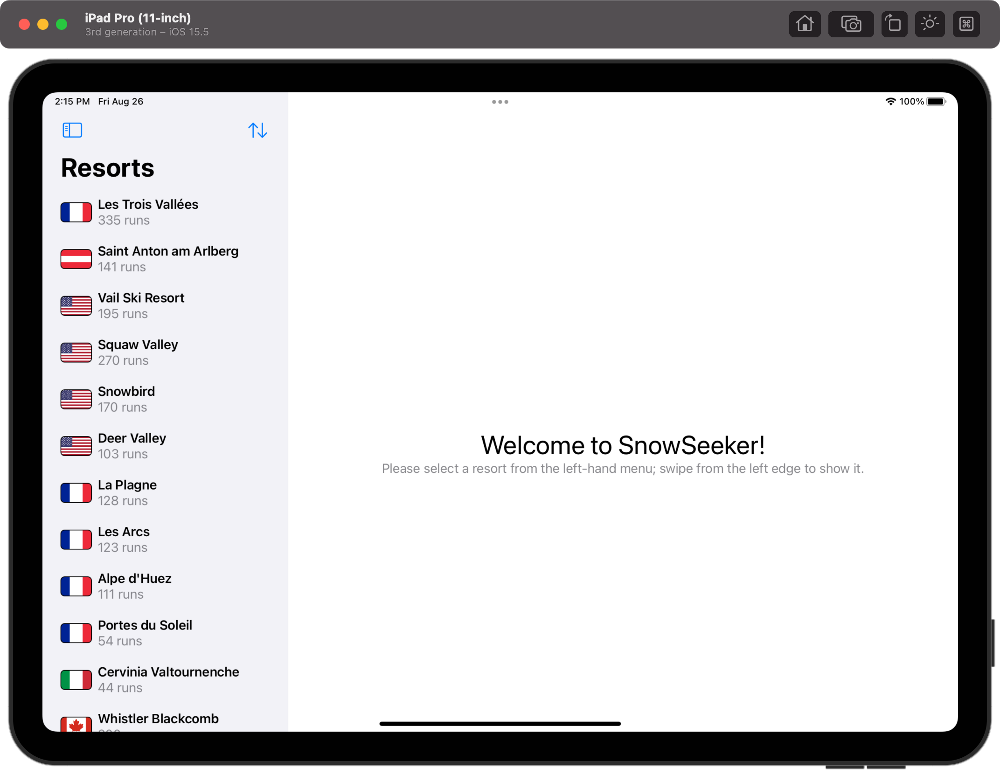

# SnowSeeker

## Project Description

The project is a part of 100 Days of SwiftUI curriculum by Paul Hudson [Hacking with swift](https://www.hackingwithswift.com/100/swiftui)

The app to let users browse ski resorts around the world, to help them find one suitable for their next holiday.

## Project Screen

    

